# Strapi 学习

> 官方的描述是`无头的CMS`，听起来很吓人对不对，说的通俗一些，他可以十分简便的进行内容管理，并且暴露对应的接口，让外部调用，文件上传，接口权限，token全部都已经内置了，相比于`json-server`或者`mock.js`功能上更加强大


## 关于本文

> 自己学习并使用`strapi`的记录，旨在帮助小伙伴们少走弯路

[官网](https://strapi.io/documentation/3.0.0-beta.x/getting-started/introduction.html)永远是你的好伙伴，请收藏!

* 本文并不能代替官方文档，所有的内容也都是基于官方文档+自己尝试的记录。

* 基本所有章节基本都会附上对应的文档链接，强烈建议你点看看看
* 所有结合代码操作的部分，建议自己动手尝试一下

* 如果英文水平和我一样不是很好，善用谷歌的翻译功能: 


## 视频教程

英文教程:https://www.youtube.com/watch?v=6FnwAbd2SDY

B站链接:https://www.bilibili.com/video/BV1g54y1R7WY?from=search&seid=3286226291596019120

两个视频是相同的，感谢搬运工

## 安装

> 官网提供了很多种安装的方式，本文选用了官网提供的第一种方式`CLI`脚手架的方式

[Installation(安装)](https://strapi.io/documentation/3.0.0-beta.x/getting-started/installation.html)


### 环境要求

确保安装了[Node.js](https://nodejs.org/zh-cn/)，版本不得低于下图

| Software | Minimum version |
| -------- | --------------- |
| Node.js  | 12.x            |
| npm      | 6.x             |

用`yarn`也可以，如果你还不知道如何使用,可以看看[这里](https://classic.yarnpkg.com/zh-Hans/docs/getting-started),可以理解为第三方的`node`包管理工具，`facebook`推出，命令和`npm`略有不同，但是功能上差别不大。


### 创建项目

在你希望创建项目的位置打开终端，执行如下命令，其中`my-project`是项目名称，可以根据需求修改：

不要用中文名！

不要用中文名！

不要用中文名！


使用`npm`创建

```bash
npx create-strapi-app my-project --quickstart
```

使用`yarn`创建

```bash
yarn create strapi-app my-project --quickstart
```

安装需要的时间挺长的，需要下载将近300M的东西，所以这里耐心等待一会


`npx`是`npm>=5.2`版本之后自动安装的一个全局模块:一个很厉害的模块运行工具,通过它运行模块时：

1. 当前目录`node_modules`中有就运行
2. 1找不到，就去`PATH`环境变量中找
3. 2找不到，就去帮你下载，然后执行

所以有了它之后，我们可以不用安装`CLI`，通过`npx`直接运行即可：比如

```bash
# 创建 react项目
npx create-react-app my-react-app
# 创建 vue项目
npx vue create my-vue-app
```


### 运行项目

创建完毕之后，默认会直接运行项目，自动打开浏览器


除非出现了一些意外情况：

* `1337`端口被占用
  * 一般来说这个端口很难被用到，尝试重启一下
* 装包失败
  * 如果是这个问题，可以尝试`cd`到创建的目录下`my-project`(这里使用了默认的目录)，如果你换了项目名用你自己的目录即可
  * 装包:
    * npm安装:`npm i `
    * yarn安装:`yarn`
    * cnpm安装:`cnpm i`
* 运行项目：
  * 保证包安装完毕之后可以通过`npm run develop`运行


无论是运行项目，还是手动装包自己运行项目，最终都会打开一个网页：


### 注册管理员账户

上一步打开的页面是让你注册一个管理员账号，这个账号拥有最高级的管理权限，不过开发阶段保存的是本地，所以可以根据喜好自行选择`用户名`和`密码`，`邮箱`保证格式正确即可，底部的勾选也不是必须的。

填写好资料之后点击`准备开始`，可能要稍微等一会，如果没反应可以尝试多点几次。

我每次新建项目都要点好几次。。。。o(╯□╰)o

看到了如下界面，说明成功了


### 数据库

到目前为止我们好像没有准备任何的数据库对不对，使用`--quickstart`模式时，内部会使用`SQLite`，我们什么都不用配。

当然，如果想要自己选用其他的数据库就不能不使用`--quickstart`这个命令了

因为笔者都是基于`sqlite`的来使用的，还没有尝试连接其他的数据库 😢，不过这里附上链接

[database(数据库)](https://strapi.io/documentation/3.0.0-beta.x/guides/databases.html)

Strapi 目前支持如下数据库

| Database   | Minimum version |
| ---------- | --------------- |
| SQLite     | 3               |
| PostgreSQL | 10              |
| MySQL      | 5.6             |
| MariaDB    | 10.1            |
| MongoDB    | 3.6             |

## 基本使用

> 本章我们来一起创建数据表，添加字段，在图形化界面管理数据，并且开放接口的访问权限

[快速入门指南](https://strapi.io/documentation/3.0.0-beta.x/getting-started/quick-start.html)

[教程](https://strapi.io/documentation/3.0.0-beta.x/getting-started/quick-start-tutorial.html)

官网的快速指南和教程操作的表格有两张，并且涉及到关联，略微复杂一些，这里我们先以一张表为例


### 数据表创建


选择左侧的`Content-Type Builder`

然后点击中间区域的`Create new collection type`


在弹出的窗口中输入`集合名称`,或者可以称之为`表名`

右侧的`UID`是唯一标记，不需要设置会自动生成

我们这里创建表名`article`

点击继续


### 添加字段

上一步点击继续之后，会弹出如下窗口


如果无意之中关掉了，可以先点击对应的数据表，然后点击右侧的`Add another field`


新增字段的选项中含义都比较好懂，我们来新建2个字段：

1. 标题:
   1. 点击`文字`
   2. 
   3. 输入字段名，然后点击`进阶设定`
   4. 
   5. 在进阶设定中勾选`必填栏位`和`唯一栏位`
   6. 表名该字段是必须的并且唯一
   7. 然后点击继续添加
   8. 

2. 内容:
   1. 点击`Rich Text`富文本
   2. 
   3. 输入字段名，然后点击`finish`，这一步不做`进阶设定`
   4. 


标题和内容添加完毕之后，我们应该会有了2个字段`title`和`content`

确认没问题之后，点击`储存`

会自动重启，如果没有异常提示，说明创建成功啦


### 图形化数据操纵


点击左侧的`Articles`,然后点击右侧的`建立新的Article`


在弹出的界面是输入标题和内容，然后点击`储存`

可以多添加几个，

点击进去之后可以修改数据


注意：

* 测试时，内容区域中文无法添加，但是英文可以

* 一会我们通过接口的方式来操纵，这里不用纠结


### 接口获取数据


`strapi`默认会根据数据表帮我们生成一套`RESTAPI`我们来测试一下获取数据

在浏览器中新开一个窗口，输入`http://localhost:1337/articles`

如果你没有修改过端口，那么看到的应该是下图


或者没有换行和缩进的如下文本:

```json
{"statusCode":403,"error":"Forbidden","message":"Forbidden"}
```

What? 并不是`404`，而是`403`,接口是存在的，但是我们不允许访问咋办呢？


### 设置接口权限


`strapi`默认的内容是受权限限制的，咱们接下来开放访问的权限：

1. 点击`身份与权限`
2. 点击`public`右侧的编辑图标


3. 确保选择的是`Article`
4. 勾选下方的`find`
5. 点击右上角的`储存`


6. 再次回到之前的页面`http://localhost:1337/articles`
7. 刷新应该就可以看到如下的内容了
   1. 这里是我的内容，你的内容应该和我的不太一样
   2. 当然，这不是问题

```json
[
  {
    "id": 1,
    "title": "这是一个寂寞的天",
    "content": "this is a loneliness ",
    "created_at": "2020-04-18T08:55:40.664Z",
    "updated_at": "2020-04-18T08:55:40.664Z"
  }
]

```

更多的接口地址我们一会来看 ^_^


## RESTAPI

> 上一步开放了查询接口，然后就可以获取到添加的所有数据了，其他的接口呢，数据的操纵应该是增删改查对不对


### 设置接口权限

来到接口权限设置界面，还是选择`public`，我们这一次把`Article`的所有接口权限都放通


### 接口地址

[传送门](https://strapi.io/documentation/3.0.0-beta.x/content-api/api-endpoints.html)

基础的接口地址格式是有规律的，我们以上文创建的`Article`为例

创建时输入的名字是`article`，生成的数据表叫做`articles`

左侧省略了基地址:`http://localhost:1337`

| 请求方法 | 接口地址          | 接口描述           | 参数                                                         |
| :------- | :---------------- | :----------------- | ------------------------------------------------------------ |
| GET      | `/articles`       | 获取文章列表       | 无                                                           |
| GET      | `/articles/:id`   | 根据id获取某篇文章 | id，直接放在url中即可                                        |
| GET      | `/articles/count` | 获取文章的数量     | 无                                                           |
| POST     | `/articles`       | 创建新文章         | `{title:"标题",content:"内容"}`                              |
| DELETE   | `/articles/:id`   | 根据id删除指定文章 | id，直接放在url中即可                                        |
| PUT      | `/articles/:id`   | 根据id修改文章     | id，直接放在url中即可，data中传递`{title:"标题",content:"内容"}` |

其他的数据表只需要把上表中的`articles`替换了即可


### 测试工具

可以写代码测试接口，不过这么做比较麻烦，所以这里推荐2个测试工具：

1. [postman](https://www.postman.com/)


2. [Insomnia](https://insomnia.rest/)


界面略有不同，但是用法大同小异，本文中使用`postman`作为 测试工具


### 接口测试 -获取文章

接下来我们就使用`postman`来测试一下接口


| 请求方法 | 接口地址    | 接口描述     | 参数 |
| :------- | :---------- | :----------- | ---- |
| GET      | `/articles` | 获取文章列表 | 无   |

1. 点击加号创建新分栏
2. 输入地址：`基地址`+`接口地址`
   1. 基地址:http://localhost:1337
3. 点击右侧的发送
4. 底部返回数据
   1. 大伙的数据应该和我的不一样，当然，这并不重要


### 接口测试 - 获取文章 基于id


| 请求方法 | 接口地址        | 接口描述                            | 参数                  |
| :------- | :-------------- | :---------------------------------- | --------------------- |
| GET      | `/articles/:id` | Get a specific {content-type} entry | id，直接放在url中即可 |

做法和上一步一样：

1. 点击+号新建分栏
   1. 这一步不是必须的，也可以在上一个页面修改地址
2. 输入地址，依旧是`基地址`+`接口地址`，在最后用`/`的方式分隔一个id出来
3. 点击发送
4. 如果没有问题即可看到对应的数据返回


### 接口测试 -文章数量

| 请求方法 | 接口地址          | 接口描述       | 参数 |
| :------- | :---------------- | :------------- | ---- |
| GET      | `/articles/count` | 获取文章的数量 | 无   |

记得修改地址即可，之后的步骤完全一致


### 接口测试 - 创建文章


| 请求方法 | 接口地址    | 接口描述   | 参数                            |
| :------- | :---------- | :--------- | ------------------------------- |
| POST     | `/articles` | 创建新文章 | `{title:"标题",content:"内容"}` |

步骤：

1. 在新建或者原有的分栏中输入地址
2. 修改请求方法为`post`
3. 参数的提交格式为`json`这里需要注意
4. 点击提交
5. 然后获取返回值即可


### 接口测试 - 删除文章

| 请求方法 | 接口地址        | 接口描述           | 参数                  |
| :------- | :-------------- | :----------------- | --------------------- |
| DELETE   | `/articles/:id` | 根据id删除指定文章 | id，直接放在url中即可 |

步骤：

1. 修改请求方法为`delete`
2. 在地址的后面拼接上文章的`id`
3. 点击发送
4. 删除成功之后，可以在返回的结果中看到删除的数据
5. 再次调用查询接口会发现这条数据已经被删除了


### 接口测试 - 修改文章


| 请求方法 | 接口地址        | 接口描述       | 参数                                                         |
| :------- | :-------------- | :------------- | ------------------------------------------------------------ |
| PUT      | `/articles/:id` | 根据id修改文章 | id，直接放在url中即可，data中传递`{title:"标题",content:"内容"}` |

步骤:

1. 修改地址和请求方法，注意url中需要拼接id
2. 选择body，然后选择raw，选择json
3. 把需要修改的字段通过`json`格式写到`body`中
4. 点击发送
5. 如果没有问题，就能接收到修改之后的数据了


## 文件上传

> 文件上传`strapi`默认也帮助我们整合了哦，如何使用呢？我们分别来演示一下，网页端上传和接口中上传


### 网页上传

我们首先来看看如何在网页端上传：

1. 左侧选择`Media Library`
2. 点击中间的`Upload assets`


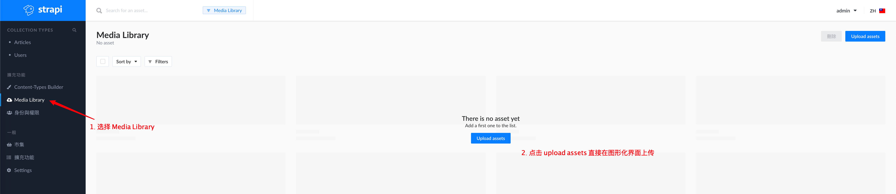

3. 在弹出的页面中选择要上传的文件

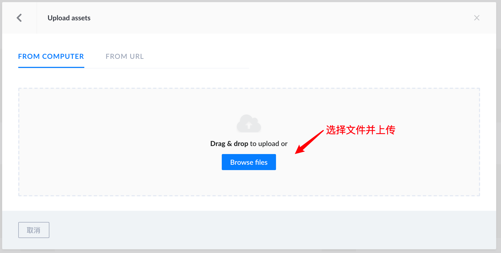


4. 根据需求继续选择文件
5. 或者点击绿色按钮完成上传

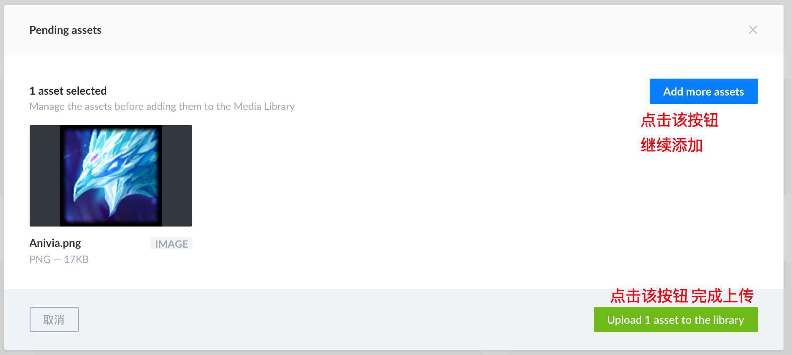

6. 上传完成之后可以看到该文件
7. 点击可以进入详情，进行更为精细的设置

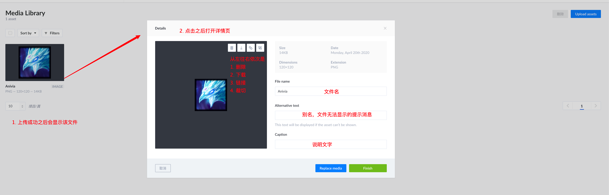


### 上传接口

[官方文档](https://strapi.io/documentation/3.0.0-beta.x/plugins/upload.html#configuration)

官方文档中对于文件的上传接口有很多个，除了基础的上传接口以外，还有统计，删除，根据id获取等等。。

本文中重点演示上传接口:

步骤：

1. 左侧点击身份与权限
2. 选择`public`
3. 底部选择`upload`
   1. 在展开的菜单中勾选`upload`放通该接口的权限
4. 点击左上角的`储存`

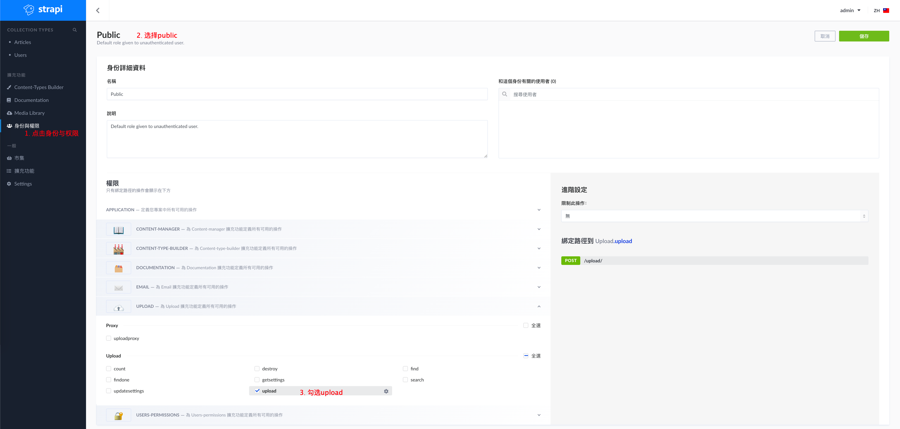


### 测试上传接口

依旧选用`postman`来进行接口的测试

| 请求方法 | 接口地址  | 接口描述 | 参数                    |
| :------- | :-------- | :------- | ----------------------- |
| POST     | `/upload` | 文件上传 | files ,类型选择文件即可 |

步骤：

1. 修改地址和请求方法
2. 选择body然后选择form-data
3. key是`files`，鼠标在后面稍微悬停一会，选择`file`
4. 点击后面的`select files`选择上传的文件
5. 点击send即可提交

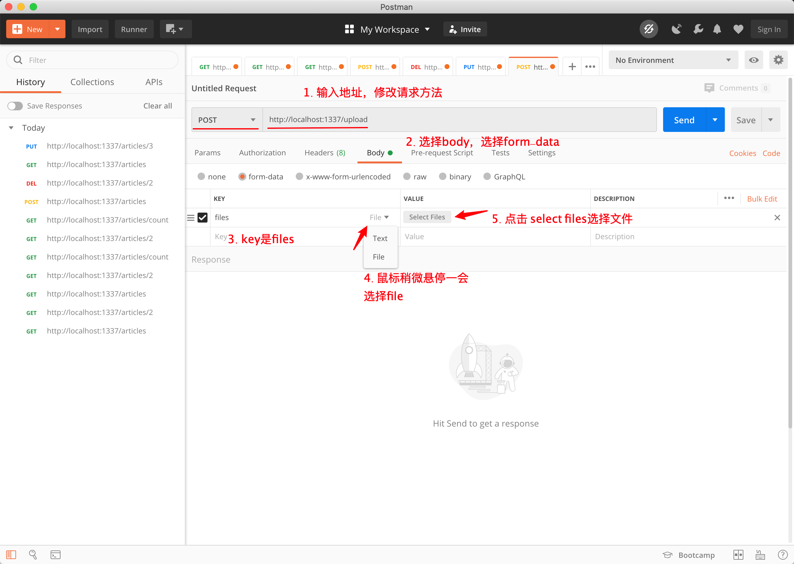


6. 如果没有问题就可以看到类似于如下的响应信息

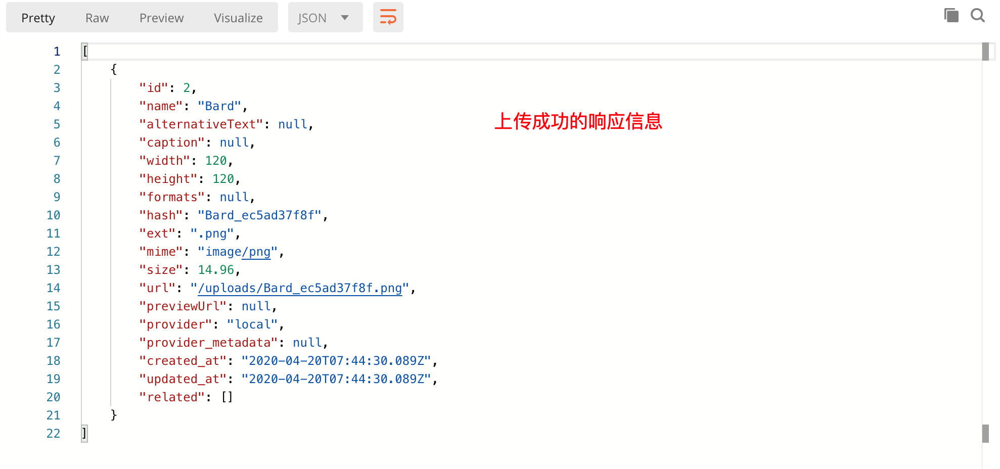

7. 同时在网页中`Media library`中可以看到刚刚上传的文件，如果没有可以刷新一下页面

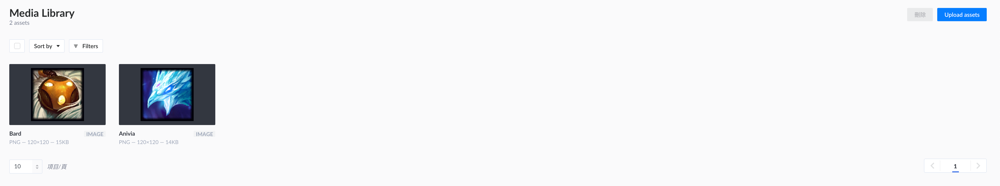


### 备注

1. 数据表中可以选择`Media`类型，但是这样就需要通过`form-data`将数据和媒体文件一起上传，这部分操作可以参考官方文档
   1. [官方指南-新建restaurant数据表](https://strapi.io/documentation/3.0.0-beta.x/getting-started/quick-start-tutorial.html#_3-create-a-new-collection-type-called-restaurant)
   2. [新增条目时上传文件](https://strapi.io/documentation/3.0.0-beta.x/plugins/upload.html#upload-file-during-entry-creation)
2. 现在更加流行的方式是，文件上传为单独的接口，数据中保存文件的地址即可，所以本文这部分内容就不再演示了


##  查询参数

> 基础的增删改查接口已经演示完毕了，文件上传也演示完毕了，如果数据的获取需要加上各种条件呢，比如排序，比如搜索，这个时候我们就可以使用查询参数了

[官网传送门-Parameters](https://strapi.io/documentation/3.0.0-beta.x/content-api/parameters.html#available-operators)

这部分的内容直接摘录于官网,并稍作调整

可用的运算符主要有如下四类

- [Filters](https://strapi.io/documentation/3.0.0-beta.x/content-api/parameters.html#filters)：筛选
- [Sort](https://strapi.io/documentation/3.0.0-beta.x/content-api/parameters.html#sort)：排序
- [Limit](https://strapi.io/documentation/3.0.0-beta.x/content-api/parameters.html#limit)：限制
- [Start](https://strapi.io/documentation/3.0.0-beta.x/content-api/parameters.html#start)：开始索引，一般结合`Limit`实现分页

### Filters - 筛选

筛选条件直接作为查询字段的后缀使用

- 无后缀或`eq`：等于
- `ne`：不等于
- `lt`： 少于
- `gt`： 比...更棒
- `lte`：小于或等于
- `gte`：大于或等于
- `in`：包含在值数组中
- `nin`：不包含在值数组中
- `contains`：包含
- `ncontains`：不包含
- `containss`：包含区分大小写
- `ncontainss`：不包含区分大小写
- `null`：为空/不为空
- `_q`:全文模糊搜索，这部分内容是阅读[自定义控制器](https://strapi.io/documentation/3.0.0-beta.x/concepts/controllers.html#find)发现的

例子

查询标题`title`是`西兰花`的文章

```
GET /articles?title=西兰花  或者 GET /articles?title_eq=西兰花
```

查找年龄`age`大于或等于18的用户

```
GET /user?age_gte=3
```

查找`id`是1，5，7的文章

```
GET /articles?id_in=1&id_in=5&id_in=7
```

全文模糊搜索，任意字段中有`西`的文章

```
GET /articles?_q=西
```


### Sort - 排序

根据特定字段排序。

* asc:升序排列
* desc:倒序排列

**示例**

通过年龄对用户排序，升序和倒序

- 升序： `GET /users?_sort=age:ASC`
- 倒序： `GET /users?_sort=age:DESC`

多个字段上排序，年龄和身高

- `GET /users?_sort=age:asc,height:desc`
- `GET /users?_sort=age:DESC,height:ASC`


### Limit - 限制

限制返回结果的大小。

默认限制是 `100`


**示例：**

将结果长度限制为30。

```
GET /users?_limit=30
```


### Start - 起始索引

跳过特定数量的条目（尤其对于分页很有用）。


**示例**

每页10条，获取第二页

```
GET /users?_start=10&_limit=10
```

 

## 用户接口

> 默认的用户是我们在网页中添加的，也可以自行注册，然后登陆哦，这部分官网很简单，大伙可以自行阅读，或者查看我截取的内容

[官网传送门- 用户注册](https://strapi.io/documentation/3.0.0-beta.x/plugins/users-permissions.html#registration)

[官网传送门 - 用户登录](https://strapi.io/documentation/3.0.0-beta.x/plugins/users-permissions.html#login)


这2个接口默认都是开放的，我们不需要人为开启，直接即可使用哦，可以根据下图进行查看

1. 点击左侧的`身份与权限`
2. 选择`Public`
3. 选择最下面的选项`USERS-PERMISSIONS`
4. 可以看到接口相关接口都是开放的

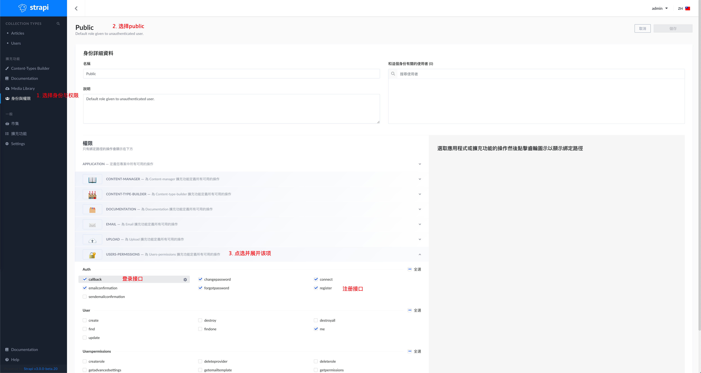


### 用户注册

注册接口的参数如下

| 请求方法 | 接口地址               | 接口描述 | 参数                                       |
| :------- | :--------------------- | :------- | ------------------------------------------ |
| POST     | `/auth/local/register` | 用户注册 | username 用户名，email 邮箱，password 密码 |

**postman请求示例：**


### 用户登录

| 请求方法 | 接口地址      | 接口描述 | 参数                                   |
| :------- | :------------ | :------- | -------------------------------------- |
| POST     | `/auth/local` | 用户登录 | identifier 用户名或邮箱，password 密码 |


**postman请求示例：**

1. 地址和请求方法不要弄错
2. JSON格式需要注意
3. 登录成功之后会返回用户的信息哦

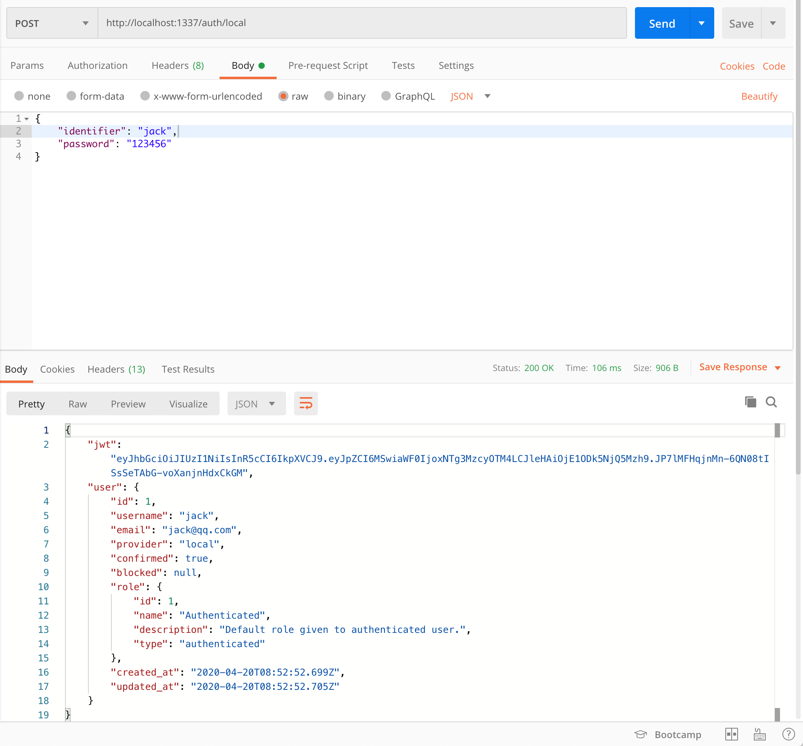

## 验证请求

> 默认的所有接口都是开放为`public`直接即可访问，这并不合理，接下来我们一起来看看如何进行校验

[官网传送门 - 验证请求](https://strapi.io/documentation/3.0.0-beta.x/guides/auth-request.html#introduction)

### 调整接口访问权限

步骤：

1. `public`中禁用所有的`articles`的接口访问

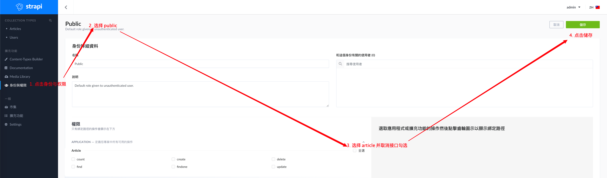

2. `authenticated`中放通`articles`中的接口访问

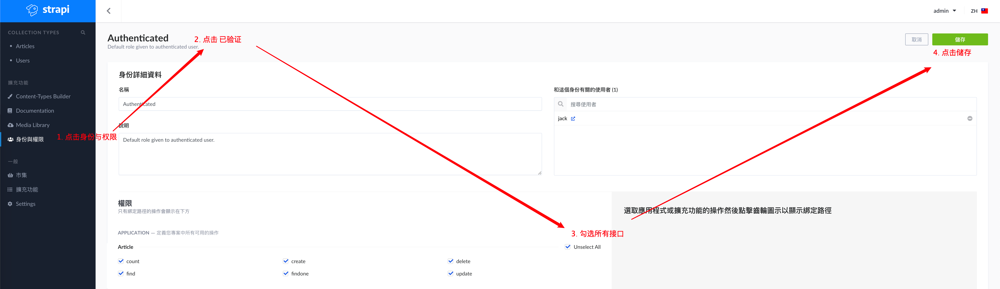


3. 可以尝试通过`postman`访问之前的接口，应该可以看到如下提示

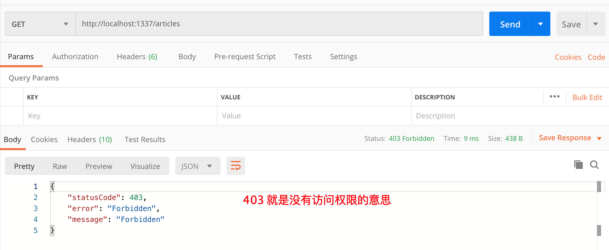


### 登录并调用接口

步骤：

1. 先使用注册的用户进行登录，比如上一步的`jack`
2. 获取到登录之后的`token`
3. token在响应的`jwt`字段后


1. 调用接口，并在`Headers`中携带token

   1. key为:`Authorization`

   2. 值为:`Bearer`空格`token`拼接起来

   3. 比如：

      1. token**为**:`eyJhbGciOiJIUzI1NiIsInR5cCI6IkpX`
      2. 提交的就是 中间用空格分隔

      ```
      Bearer eyJhbGciOiJIUzI1NiIsInR5cCI6IkpX
      ```

      3. 这里为了版面把token的值稍微缩短了一些，实际已接口返回的为准


postman调用:

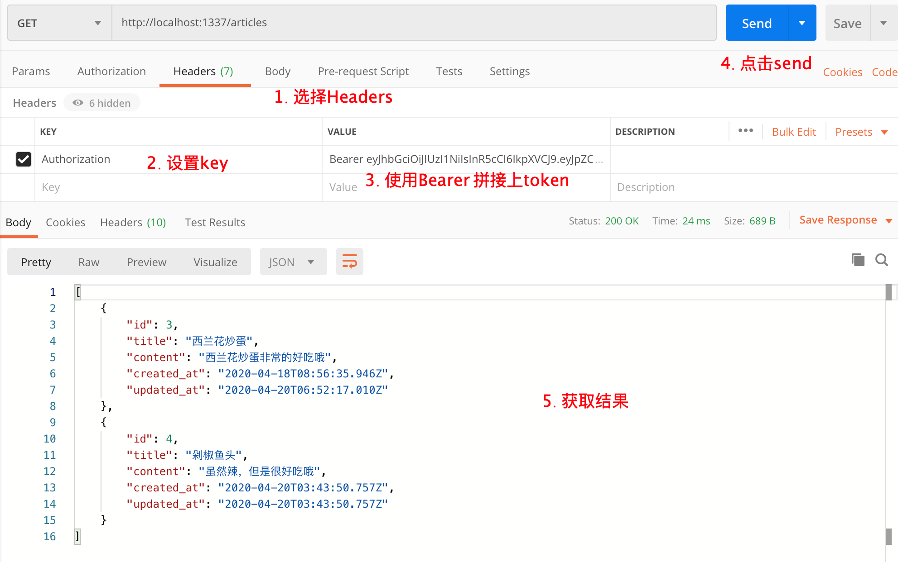


## 说点什么

基本的使用已经演示完毕了，一些我还用到的功能这里附上官网的传送门，结合谷歌翻译相信大伙应该可以弄懂。

官网是个好东西！

官网是个好东西！

官网是个好东西！

重要的事情说三遍


1. [自定义访问地址](https://strapi.io/documentation/3.0.0-beta.x/admin-panel/customization.html#change-access-url)

2. [自动生成接口文档](https://strapi.io/documentation/3.0.0-beta.x/plugins/documentation.html)
3. [控制器](https://strapi.io/documentation/3.0.0-beta.x/concepts/controllers.html#core-controllers)
   1. 如果想要在控制器中添加自定义逻辑，可以看看这个
4. [自定义响应内容](https://strapi.io/documentation/3.0.0-beta.x/guides/custom-data-response.html#custom-data-response)
   1. 默认返回的数据中字段很多，可以通过自定义响应内容移除多余部分

5. [路由](https://strapi.io/documentation/3.0.0-beta.x/concepts/routing.html)
   1. 默认的接口如果无法满足你，或者你想要添加自定义的接口（路由），可以看看这里
6. [数据库查询方法](https://strapi.io/documentation/3.0.0-beta.x/concepts/queries.html#queries)
   1. 如果希望在控制器中自己写更为复杂的数据库操纵逻辑可以看看这篇文章

.....

(待补充)最近会用这个东西模拟2个项目的接口，弄完之后有什么新收获会更新上来


