# Strapi 学习

> 官方的描述是`无头的CMS`，听起来很吓人对不对，说的通俗一些，他可以十分简便的进行内容管理，并且暴露对应的接口，让外部调用，文件上传，接口权限，token全部都已经内置了，相比于`json-server`或者`mock.js`功能上更加强大

## 关于本文

> 自己学习并使用`strapi`的记录，旨在帮助小伙伴们少走弯路

[官网](https://strapi.io/documentation/3.0.0-beta.x/getting-started/introduction.html)永远是你的好伙伴，请收藏!

* 本文并不能代替官方文档，所有的内容也都是基于官方文档+自己尝试的记录。

* 基本所有章节基本都会附上对应的文档链接，强烈建议你点看看看
* 所有结合代码操作的部分，建议自己动手尝试一下

* 如果英文水平和我一样不是很好，善用谷歌的翻译功能: 

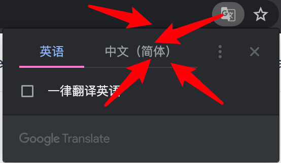


## 安装

> 官网提供了很多种安装的方式，本文选用了官网提供的第一种方式`CLI`脚手架的方式

[Installation(安装)](https://strapi.io/documentation/3.0.0-beta.x/getting-started/installation.html)


### 环境要求

确保安装了[Node.js](https://nodejs.org/zh-cn/)，版本不得低于下图

| Software | Minimum version |
| -------- | --------------- |
| Node.js  | 12.x            |
| npm      | 6.x             |

用`yarn`也可以，如果你还不知道如何使用,可以看看[这里](https://classic.yarnpkg.com/zh-Hans/docs/getting-started),可以理解为第三方的`node`包管理工具，`facebook`推出，命令和`npm`略有不同，但是功能上差别不大。


### 创建项目

在你希望创建项目的位置打开终端，执行如下命令，其中`my-project`是项目名称，可以根据需求修改：

不要用中文名！

不要用中文名！

不要用中文名！


使用`npm`创建

```bash
npx create-strapi-app my-project --quickstart
```

使用`yarn`创建

```bash
yarn create strapi-app my-project --quickstart
```

安装需要的时间挺长的，需要下载将近300M的东西，所以这里耐心等待一会


`npx`是`npm>=5.2`版本之后自动安装的一个全局模块:一个很厉害的模块运行工具,通过它运行模块时：

1. 当前目录`node_modules`中有就运行
2. 1找不到，就去`PATH`环境变量中找
3. 2找不到，就去帮你下载，然后执行

所以有了它之后，我们可以不用安装`CLI`，通过`npx`直接运行即可：比如

```bash
# 创建 react项目
npx create-react-app my-react-app
# 创建 vue项目
npx vue create my-vue-app
```


### 运行项目

创建完毕之后，默认会直接运行项目，自动打开浏览器


除非出现了一些意外情况：

* `1337`端口被占用
  * 一般来说这个端口很难被用到，尝试重启一下
* 装包失败
  * 如果是这个问题，可以尝试`cd`到创建的目录下`my-project`(这里使用了默认的目录)，如果你换了项目名用你自己的目录即可
  * 装包:
    * npm安装:`npm i `
    * yarn安装:`yarn`
    * cnpm安装:`cnpm i`
* 运行项目：
  * 保证包安装完毕之后可以通过`npm run develop`运行


无论是运行项目，还是手动装包自己运行项目，最终都会打开一个网页：


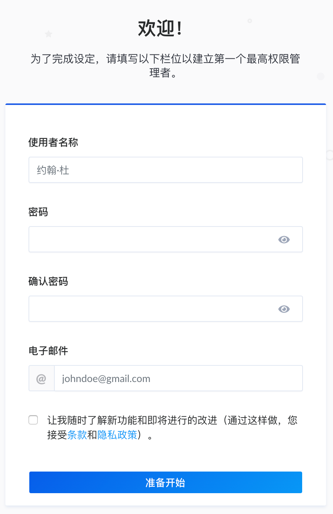


### 注册管理员账户

上一步打开的页面是让你注册一个管理员账号，这个账号拥有最高级的管理权限，不过开发阶段保存的是本地，所以可以根据喜好自行选择`用户名`和`密码`，`邮箱`保证格式正确即可，底部的勾选也不是必须的。

填写好资料之后点击`准备开始`，可能要稍微等一会，如果没反应可以尝试多点几次。

我每次新建项目都要点好几次。。。。o(╯□╰)o

看到了如下界面，说明成功了

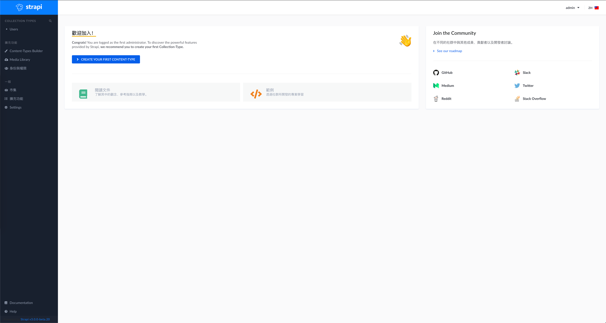


### 数据库

到目前为止我们好像没有准备任何的数据库对不对，使用`--quickstart`模式时，内部会使用`SQLite`，我们什么都不用配。

当然，如果想要自己选用其他的数据库就不能不使用`--quickstart`这个命令了

因为笔者都是基于`sqlite`的来使用的，还没有尝试连接其他的数据库 😢，不过这里附上链接

[database(数据库)](https://strapi.io/documentation/3.0.0-beta.x/guides/databases.html)

Strapi 目前支持如下数据库

| Database   | Minimum version |
| ---------- | --------------- |
| SQLite     | 3               |
| PostgreSQL | 10              |
| MySQL      | 5.6             |
| MariaDB    | 10.1            |
| MongoDB    | 3.6             |

## 基本使用

> 本章我们来一起创建数据表，添加字段，在图形化界面管理数据，并且开放接口的访问权限

[快速入门指南](https://strapi.io/documentation/3.0.0-beta.x/getting-started/quick-start.html)

[教程](https://strapi.io/documentation/3.0.0-beta.x/getting-started/quick-start-tutorial.html)

官网的快速指南和教程操作的表格有两张，并且涉及到关联，略微复杂一些，这里我们先以一张表为例


### 数据表创建


选择左侧的`Content-Type Builder`

然后点击中间区域的`Create new collection type`

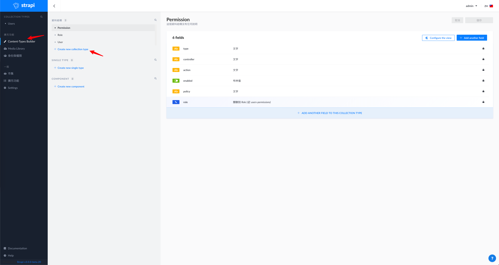


在弹出的窗口中输入`集合名称`,或者可以称之为`表名`

右侧的`UID`是唯一标记，不需要设置会自动生成

我们这里创建表名`article`

点击继续

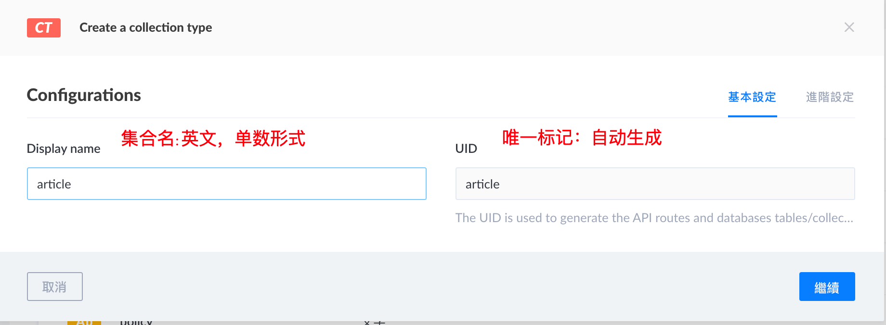


### 添加字段

上一步点击继续之后，会弹出如下窗口

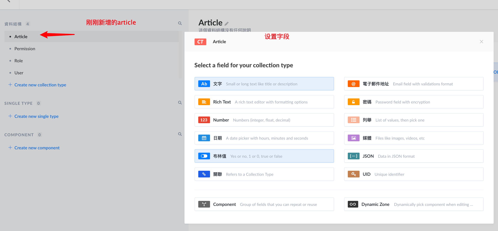

如果无意之中关掉了，可以先点击对应的数据表，然后点击右侧的`Add another field`

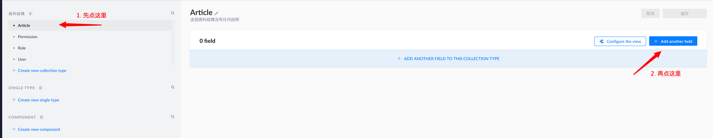


新增字段的选项中含义都比较好懂，我们来新建2个字段：

1. 标题:
   1. 点击`文字`
   2. 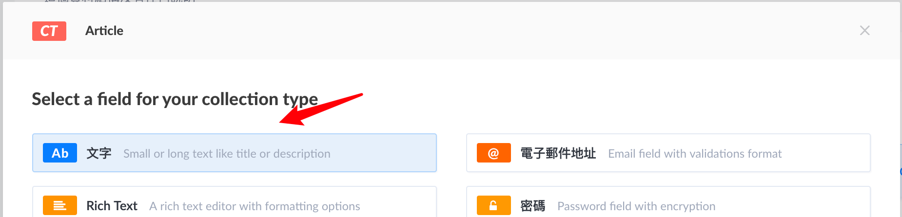
   3. 输入字段名，然后点击`进阶设定`
   4. 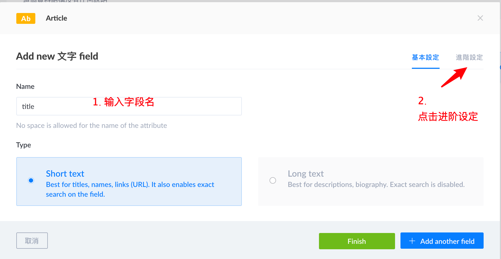
   5. 在进阶设定中勾选`必填栏位`和`唯一栏位`
   6. 表名该字段是必须的并且唯一
   7. 然后点击继续添加
   8. 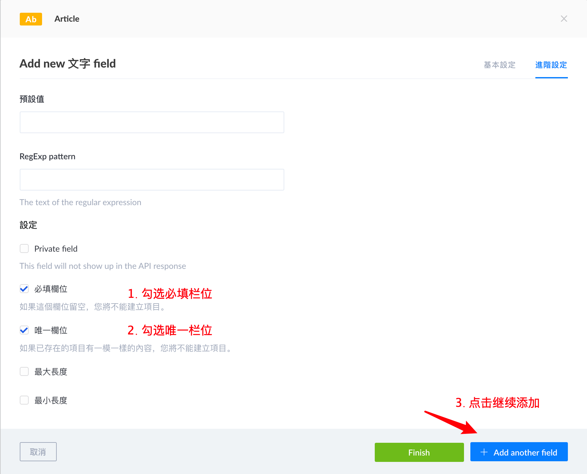

2. 内容:
   1. 点击`Rich Text`富文本
   2. 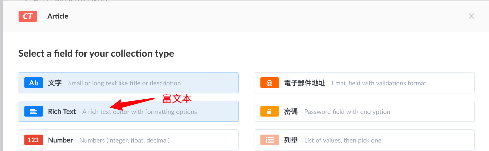
   3. 输入字段名，然后点击`finish`，这一步不做`进阶设定`
   4. 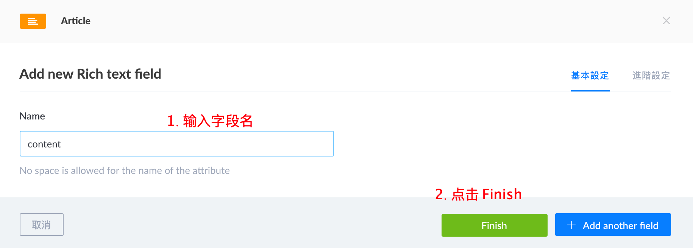


标题和内容添加完毕之后，我们应该会有了2个字段`title`和`content`

确认没问题之后，点击`储存`

会自动重启，如果没有异常提示，说明创建成功啦

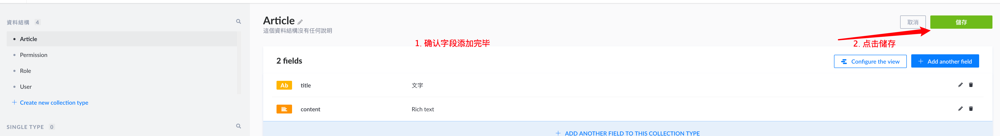


### 图形化数据操纵


点击左侧的`Articles`,然后点击右侧的`建立新的Article`

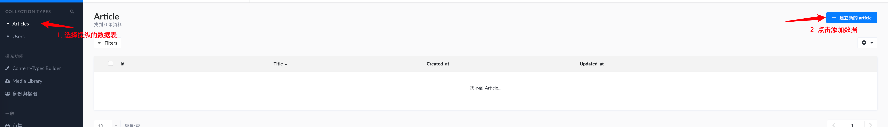


在弹出的界面是输入标题和内容，然后点击`储存`

可以多添加几个，

点击进去之后可以修改数据

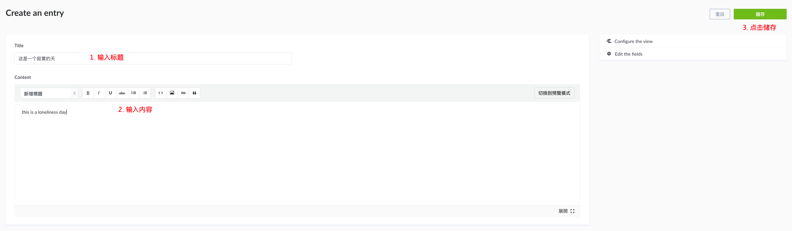

注意：

* 测试时，内容区域中文无法添加，但是英文可以

* 一会我们通过接口的方式来操纵，这里不用纠结


### 接口获取数据


`strapi`默认会根据数据表帮我们生成一套`RESTAPI`我们来测试一下获取数据

在浏览器中新开一个窗口，输入`http://localhost:1337/articles`

如果你没有修改过端口，那么看到的应该是下图

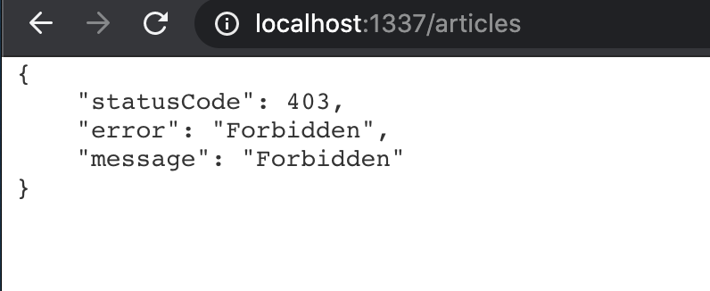

或者没有换行和缩进的如下文本:

```json
{"statusCode":403,"error":"Forbidden","message":"Forbidden"}
```

What? 并不是`404`，而是`403`,接口是存在的，但是我们不允许访问咋办呢？


### 设置接口权限


`strapi`默认的内容是受权限限制的，咱们接下来开放访问的权限：

1. 点击`身份与权限`
2. 点击`public`右侧的编辑图标

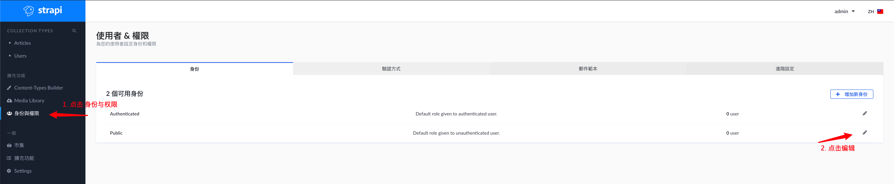

3. 确保选择的是`Article`
4. 勾选下方的`find`
5. 点击右上角的`储存`

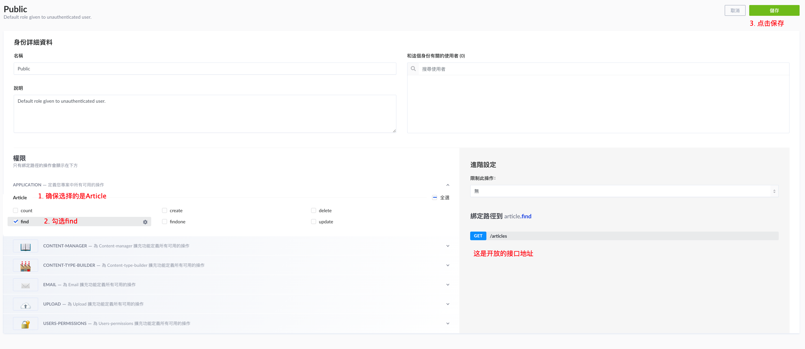

6. 再次回到之前的页面`http://localhost:1337/articles`
7. 刷新应该就可以看到如下的内容了
   1. 这里是我的内容，你的内容应该和我的不太一样
   2. 当然，这不是问题

```json
[
  {
    "id": 1,
    "title": "这是一个寂寞的天",
    "content": "this is a loneliness ",
    "created_at": "2020-04-18T08:55:40.664Z",
    "updated_at": "2020-04-18T08:55:40.664Z"
  }
]

```

更多的接口地址我们一会来看 ^_^


## RESTAPI

> 上一步开放了查询接口，然后就可以获取到添加的所有数据了，其他的接口呢，数据的操纵应该是增删改查对不对


### 设置接口权限

来到接口权限设置界面，还是选择`public`，我们这一次把`Article`的所有接口权限都放通

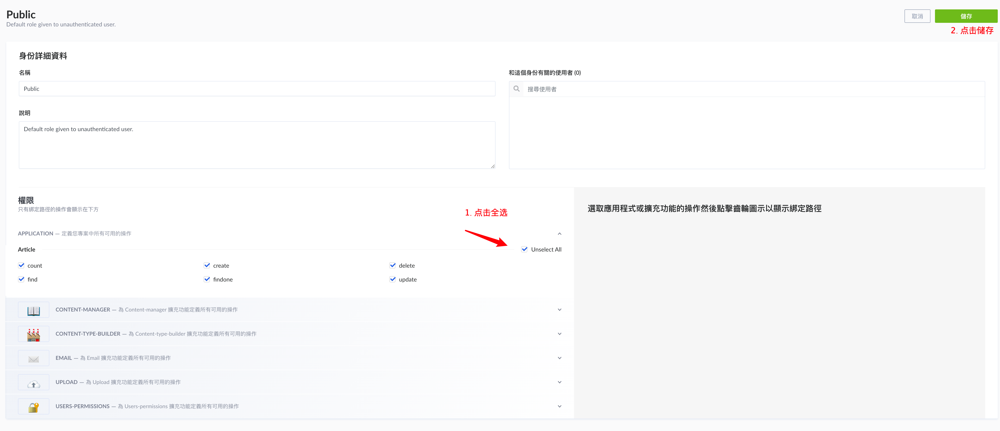


### 接口地址

[传送门](https://strapi.io/documentation/3.0.0-beta.x/content-api/api-endpoints.html)

基础的接口地址格式是有规律的，我们以上文创建的`Article`为例

创建时输入的名字是`article`，生成的数据表叫做`articles`

左侧省略了基地址:`http://localhost:1337`

| 请求方法 | 接口地址          | 接口描述           | 参数                                                         |
| :------- | :---------------- | :----------------- | ------------------------------------------------------------ |
| GET      | `/articles`       | 获取文章列表       | 无                                                           |
| GET      | `/articles/:id`   | 根据id获取某篇文章 | id，直接放在url中即可                                        |
| GET      | `/articles/count` | 获取文章的数量     | 无                                                           |
| POST     | `/articles`       | 创建新文章         | `{title:"标题",content:"内容"}`                              |
| DELETE   | `/articles/:id`   | 根据id删除指定文章 | id，直接放在url中即可                                        |
| PUT      | `/articles/:id`   | 根据id修改文章     | id，直接放在url中即可，data中传递`{title:"标题",content:"内容"}` |

其他的数据表只需要把上表中的`articles`替换了即可


### 测试工具

可以写代码测试接口，不过这么做比较麻烦，所以这里推荐2个测试工具：

1. [postman](https://www.postman.com/)

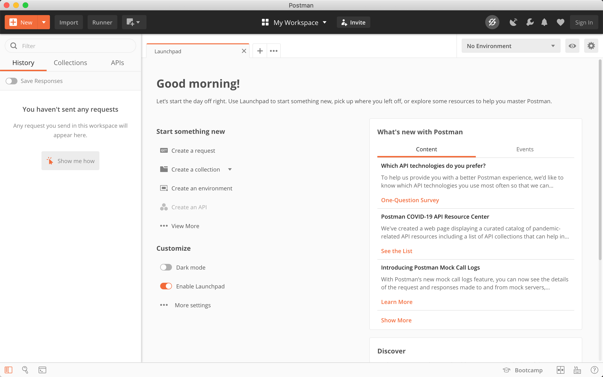

2. [Insomnia](https://insomnia.rest/)

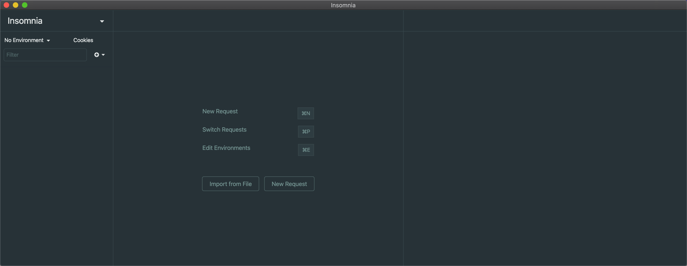


界面略有不同，但是用法大同小异，本文中使用`postman`作为 测试工具


### 接口测试 -获取文章

接下来我们就使用`postman`来测试一下接口


| 请求方法 | 接口地址    | 接口描述     | 参数 |
| :------- | :---------- | :----------- | ---- |
| GET      | `/articles` | 获取文章列表 | 无   |

1. 点击加号创建新分栏
2. 输入地址：`基地址`+`接口地址`
   1. 基地址:http://localhost:1337
3. 点击右侧的发送
4. 底部返回数据
   1. 大伙的数据应该和我的不一样，当然，这并不重要

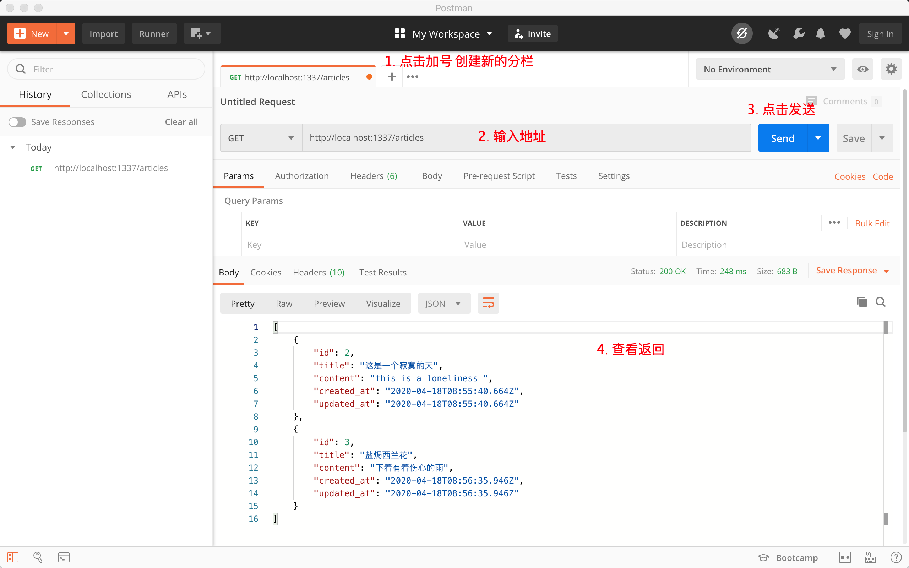


### 接口测试 - 获取文章 基于id


| 请求方法 | 接口地址        | 接口描述                            | 参数                  |
| :------- | :-------------- | :---------------------------------- | --------------------- |
| GET      | `/articles/:id` | Get a specific {content-type} entry | id，直接放在url中即可 |

做法和上一步一样：

1. 点击+号新建分栏
   1. 这一步不是必须的，也可以在上一个页面修改地址
2. 输入地址，依旧是`基地址`+`接口地址`，在最后用`/`的方式分隔一个id出来
3. 点击发送
4. 如果没有问题即可看到对应的数据返回

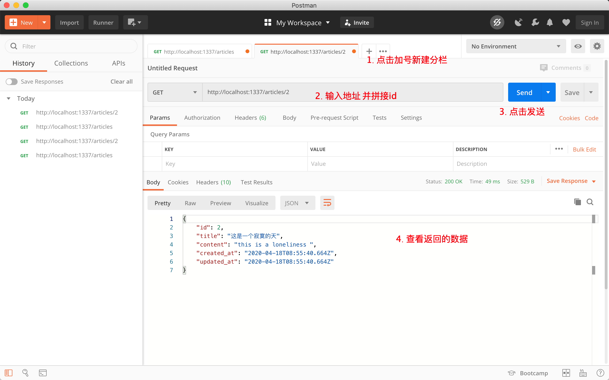


### 接口测试 -文章数量

| 请求方法 | 接口地址          | 接口描述       | 参数 |
| :------- | :---------------- | :------------- | ---- |
| GET      | `/articles/count` | 获取文章的数量 | 无   |

记得修改地址即可，之后的步骤完全一致

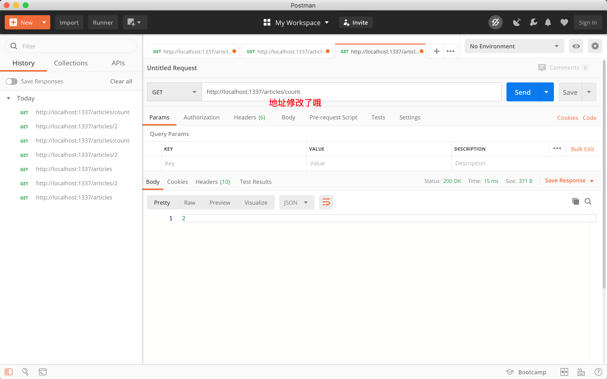

### 接口测试 - 创建文章


| 请求方法 | 接口地址    | 接口描述   | 参数                            |
| :------- | :---------- | :--------- | ------------------------------- |
| POST     | `/articles` | 创建新文章 | `{title:"标题",content:"内容"}` |

步骤：

1. 在新建或者原有的分栏中输入地址
2. 修改请求方法为`post`
3. 参数的提交格式为`json`这里需要注意
4. 点击提交
5. 然后获取返回值即可

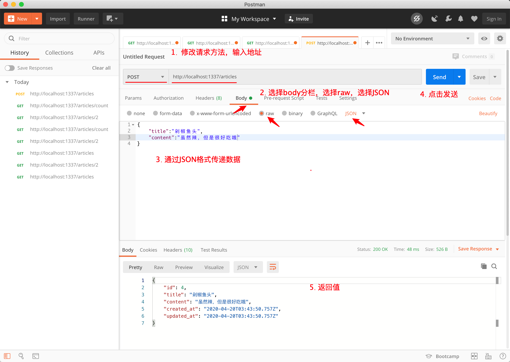


### 接口测试 - 删除文章

| 请求方法 | 接口地址        | 接口描述           | 参数                  |
| :------- | :-------------- | :----------------- | --------------------- |
| DELETE   | `/articles/:id` | 根据id删除指定文章 | id，直接放在url中即可 |

步骤：

1. 修改请求方法为`delete`
2. 在地址的后面拼接上文章的`id`
3. 点击发送
4. 删除成功之后，可以在返回的结果中看到删除的数据
5. 再次调用查询接口会发现这条数据已经被删除了


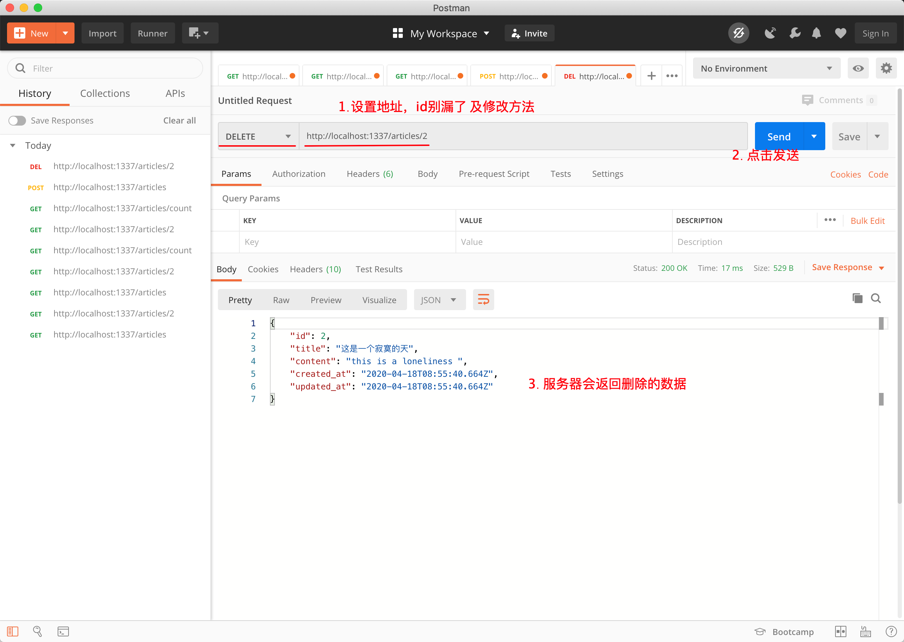


### 接口测试 - 修改文章


| 请求方法 | 接口地址        | 接口描述       | 参数                                                         |
| :------- | :-------------- | :------------- | ------------------------------------------------------------ |
| PUT      | `/articles/:id` | 根据id修改文章 | id，直接放在url中即可，data中传递`{title:"标题",content:"内容"}` |

步骤:

1. 修改地址和请求方法，注意url中需要拼接id
2. 选择body，然后选择raw，选择json
3. 把需要修改的字段通过`json`格式写到`body`中
4. 点击发送
5. 如果没有问题，就能接收到修改之后的数据了


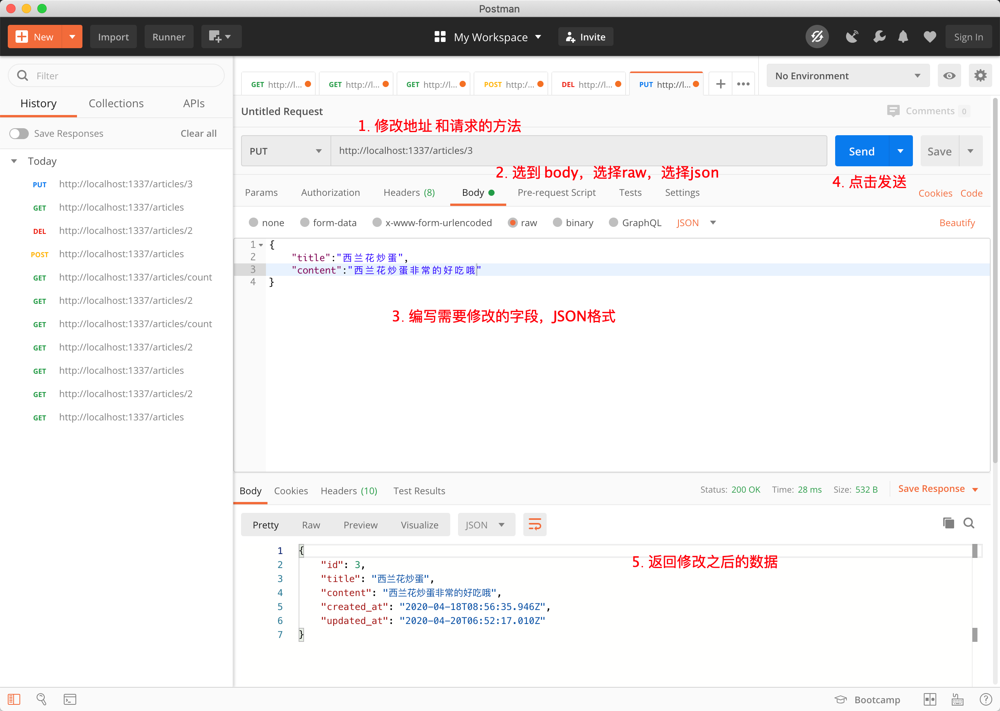


## 文件上传

> 文件上传`strapi`默认也帮助我们整合了哦，如何使用呢？


[todo]

### 项目创建

https://strapi.io/documentation/3.0.0-beta.x/getting-started/quick-start-tutorial.html#_1-install-strapi-and-create-a-project

### 数据表和字段创建
https://strapi.io/documentation/3.0.0-beta.x/getting-started/quick-start-tutorial.html#_3-create-a-new-collection-type-called-restaurant

### 数据API
https://strapi.io/documentation/3.0.0-beta.x/content-api/api-endpoints.html#endpoints

### 开放访问权限
https://strapi.io/documentation/3.0.0-beta.x/getting-started/quick-start-tutorial.html#_7-set-roles-and-permissions

### 文件上传
https://strapi.io/documentation/3.0.0-beta.x/plugins/upload.html#configuration

## 查询参数
https://strapi.io/documentation/3.0.0-beta.x/content-api/parameters.html#available-operators

### 文档生成
https://strapi.io/documentation/3.0.0-beta.x/plugins/documentation.html

### 自定义
https://strapi.io/documentation/3.0.0-beta.x/admin-panel/customization.html#change-access-url

## 进阶


1. 用户

## 自定义

1. 重写控制器
    https://strapi.io/documentation/3.0.0-beta.x/concepts/controllers.html
2. 自定义数据响应
    https://strapi.io/documentation/3.0.0-beta.x/guides/custom-data-response.html#custom-data-response
* 草稿系统
    https://strapi.io/documentation/3.0.0-beta.x/guides/draft.html
* 错误捕获
3. 添加自定义路由
   https://strapi.io/documentation/3.0.0-beta.x/concepts/routing.html
4. 数据库操纵api:
    https://strapi.io/documentation/3.0.0-beta.x/concepts/queries.html#queries
5. 异常处理
    https://strapi.io/documentation/3.0.0-beta.x/guides/error-catching.html#handle-errors


